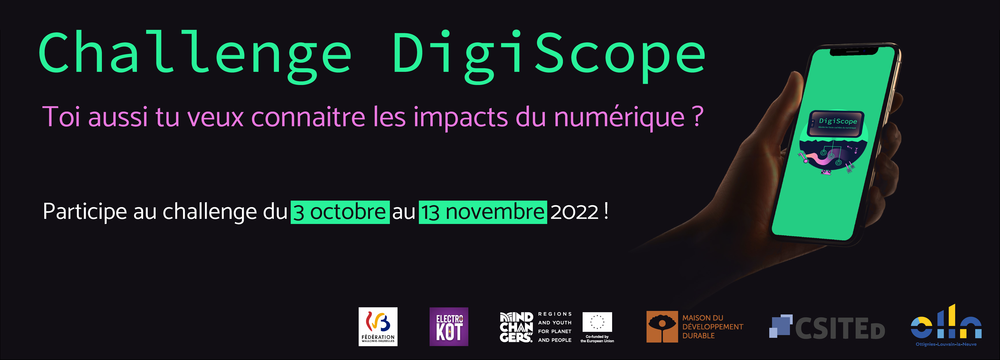
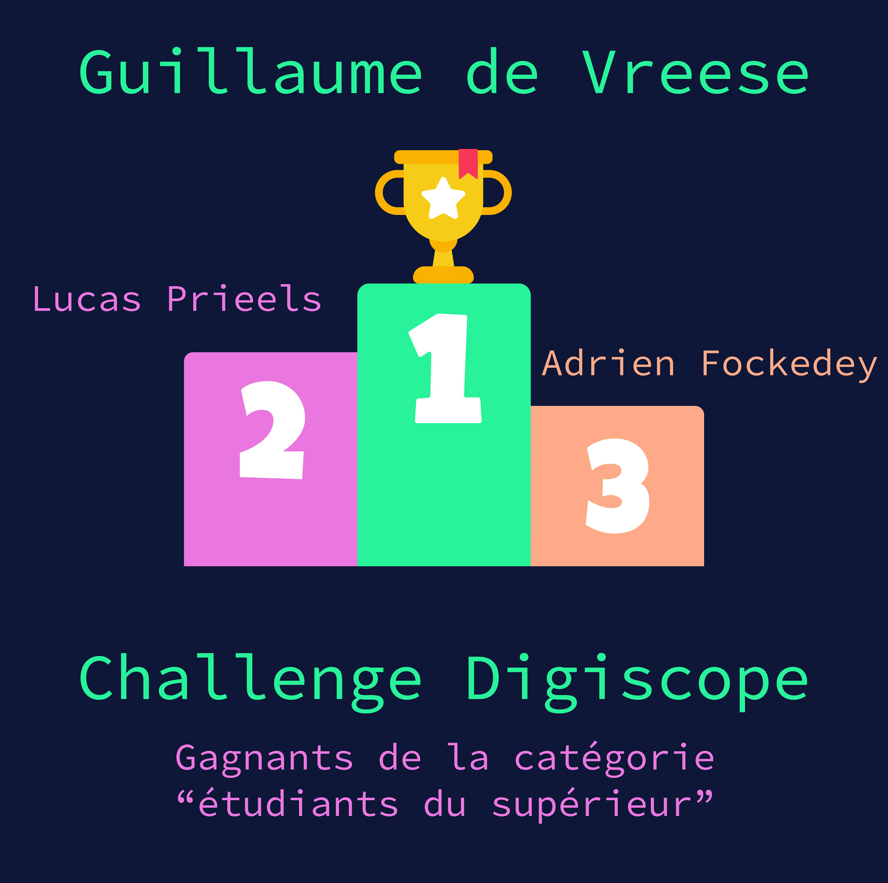

La **première édition** du challenge DigiScope s'est déroulée en 2022 et elle a attiré 147 participants et participantes provenant de toute la Fédération Wallonie-Bruxelles. Après une phase en ligne, qui s'est déroulée du 3 octobre au 13 novembre 2022, la finale a eu lieu le 23 novembre 2022 à Louvain-la-Neuve.

## Jury

Le **Jury du challenge** DigiScope 2022 était constitué d'étudiant(e)s ainsi que de jeunes diplômé(e)s et d'enseignant(e)s. La mission du Jury était de créer les questions qui ont été utilisées pour le challenge. Il se composait comme suit :

<ul style="column-count: 2;">
    <li>Sébastien Combéfis <small>(Attaché @ Ministère de la Fédération Wallonie-Bruxelles et Professeur @ ITSCM, EPHEC et Condorcet)</small></li>
    <li>Nell Daeleman <small>(Étudiante @ UCLouvain)</small></li>
    <li>Mathieu Doat <small>(Étudiant @ UCLouvain)</small></li>
    <li>Guillaume de Moffarts <small>(Software Engineer @ Mirrhia)</small></li>
    <li>Maxime Denis <small>(Software Engineer @ Semetis)</small></li>
    <li>Jean-Baptiste Denoël <small>(Étudiant @ UCLouvain)</small></li>
    <li>Louis de Viron <small>(Data Scientist @ DataText)</small></li>
    <li>Sébastien d'Oreye <small>(Functional Analyst @ SPF Finances)</small></li>
    <li>Pierre-Yves Gousenbourger <small>(Professeur @ EPHEC)</small></li>
    <li>Nicolas Huberty <small>(Étudiant @ UCLouvain)</small></li>
    <li>Éric Lebeau <small>(Data Engineer @ Belfius)</small></li>
    <li>Simon Maldague <small>(Étudiant @ UCLouvain)</small></li>
    <li>Nathan Nepper <small>(Étudiant @ UCLouvain)</small></li>
    <li>Léa Reyntjens <small>(Étudiante @ UCLouvain)</small></li>
    <li>Alexandre Rucquoy <small>(Developer @ Oniryx)</small></li>
    <li>Thomas Schiltz <small>(Étudiant @ UCLouvain)</small></li>
    <li>Virginie Van den Schrieck <small>(Professeure @ EPHEC)</small></li>
    <li>Damien Vanhove <small>(Project Manager @ Future Resources SA)</small></li>
</ul>

## Lauréats

Les **lauréat(e)s de l'édition 2022** du challenge DigiScope sont :

        
<b>Catégorie élève du secondaire</b>

        

        
<ol>
            <li><small>Natan Duez (Nespa BW) ;</small></li>
            <li><small>Louise Dubois (Nespa BW) ;</small></li>
            <li><small>Zoé Godart (Institut Paridaens).</small></li>
        </ol>

        
<b>Catégorie étudiant(e) du supérieur</b>

        

        
<ol>
            <li><small>Guillaume de Vreese (UCLouvain) ;</small></li>
            <li><small>Lucas Prieels (ULB) ;</small></li>
            <li><small>Adrien Fockedey (UCLouvain).</small></li>
        </ol>

        
<b>Catégorie grand public</b>

        

        
<ol>
            <li><small>Florence Dequenne (Vivre l'harmonie) ;</small></li>
            <li><small>Maxime Aerts (ULiège) ;</small></li>
            <li><small>Carine Charvet (Forem).</small></li>
        </ol>

## Ressources

- [Recueil des questions de la phase en ligne (PDF, 516 Ko)](../../files/Recueil-questions-phase-en-ligne_Challenge-digiscope-2022.pdf)
- Recueil des questions de la finale (à venir)
