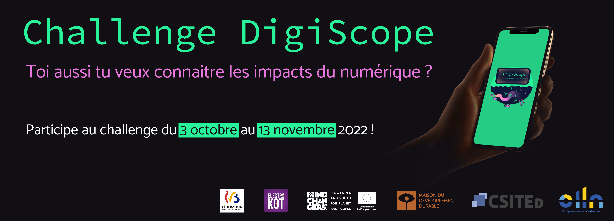

Le challenge DigiScope a pour objectif de sensibiliser et faire réfléchir les Belges aux **impacts**, tant positifs que négatifs, résultant de l'**utilisation de technologies numériques**. Aujourd'hui, ces technologies prennent de plus en plus de places dans notre société et nos vies, et certains poussent à une numérisation massive d'une majorité des aspects de nos vies.

D'un côté, l'outil numérique est formidable et ouvre de nombreuses possibilités nouvelles, mais son usage n'est pas sans impacts sur **l'environnement, le climat, la santé, le bien-être, la biodiversité**, etc. L'outil numérique n'est pas la solution miracle à tous les problèmes et il convient de l'utiliser de manière responsable et en ayant conscience des impacts associés à son usage.

Pour sensibiliser la population, **des jeunes réunis en un Jury** vous proposent de participer à ce challenge DigiScope constitué de questions à choix multiples qu'ils et elles ont sélectionné pour vous !

Après une phase en ligne, qui se déroule du 3 octobre au 13 novembre 2022, les 15 candidats et candidates les mieux classés dans trois catégories (élèves du secondaire, étudiant du supérieur et grand public) seront invités à une finale qui aura lieu à Louvain-la-Neuve le 23 novembre 2022, en soirée. Qui dit challenge dit également **prix** :

- 1er prix : cadeau d’une valeur de 300 €
- 2ème prix : cadeau d’une valeur de 200 €
- 3ème prix : cadeau d’une valeur de 80 €

De plus, tous les finalistes repartiront avec un chèque cadeau durable.

## Participer

Pour vous inscrire et participer au challenge, rendez-vous sur la page suivante : [https://challenge.digi-scope.be](https://challenge.digi-scope.be).
