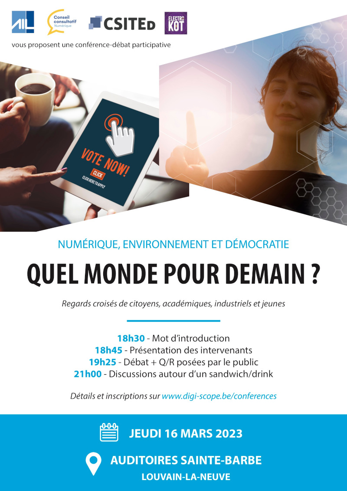

Le **numérique** est de plus en plus présent dans tous les aspects de nos vies, et tout cela va s'accélérer et s'accentuer. Cela pose évidemment toute une série de questions par rapport au monde vers lequel on semble se diriger. Tout d'abord par rapport aux **impacts** que le numérique peut avoir sur notre **environnement**, au sens large (écologie, biodiversité, bien-être, santé, etc.) et également par rapport aux **transformations** que le numérique va faire subir à la **démocratie**.

L'objectif de la conférence-débat est de proposer à son public des **regards croisés** sur ces questions, par différents groupes de personnes : les citoyens, les jeunes, les académiques et les entreprises.

## Organisateurs

Cette conférence est co-organisée par **quatre partenaires** :

- l'<a href="https://www.ailouvain.be" target="_blank">AILouvain</a>, le réseau des diplômés de l'École Polytechnique de Louvain,
- le <a href="https://www.olln.be/fr/ma-ville/vie-politique/conseils-consultatifs/numerique" target="_blank">Conseil Consultatif du Numérique</a> de la Ville d'Ottignies-Louvain-la-Neuve,
- la <a href="https://www.csited.be/fr" target="_blank">Computer Science and IT in Education ASBL</a>, dans le cadre du projet DigiScope,
- et l'<a href="https://kapuclouvain.be/portfolio-items/electrokot" target="_blank">Electro kot</a>, un kot à projet centré sur la réparation, le recyclage et la réutilisation d'appareils électroniques.

## Intervenants

En plus des interventions des membres du panel, le public sera sollicité et des questions pourront être ainsi posées aux intervenants, que ce soit en direct dans le courant de la soirée ou par après.

## Déroulé de la soirée

- 18h30 : Mot d'introduction par Sébastien Combéfis
- 18h45 : Présentation des intervenants
- 19h25 : Débat animé par Steve Tumson et échanges avec le public
- 21h00 : Discussions informelles autour d'un sandwich et d'un verre

## Inscription

Pour vous inscrire **gratuitement**, et donc assister, à la conférence-débat rendez-vous sur le formulaire suivant :

- <a href="https://docs.google.com/forms/d/e/1FAIpQLScF1rhAEL18VHjE_ZtbE28Py2cO5TdoSsq4wxptGhhm8AcCDw/viewform?usp=sf_link" target="_blank">Inscription à la conférence-débat du 16 mars 2023</a>.

Une **cagnotte libre** sera mise à disposition pour que celles et ceux qui souhaitent contribuer au projet DigiScope puissent déposer un petit don, ce qui nous permettra de développer et de prévoir de futurs évènements et activités.
